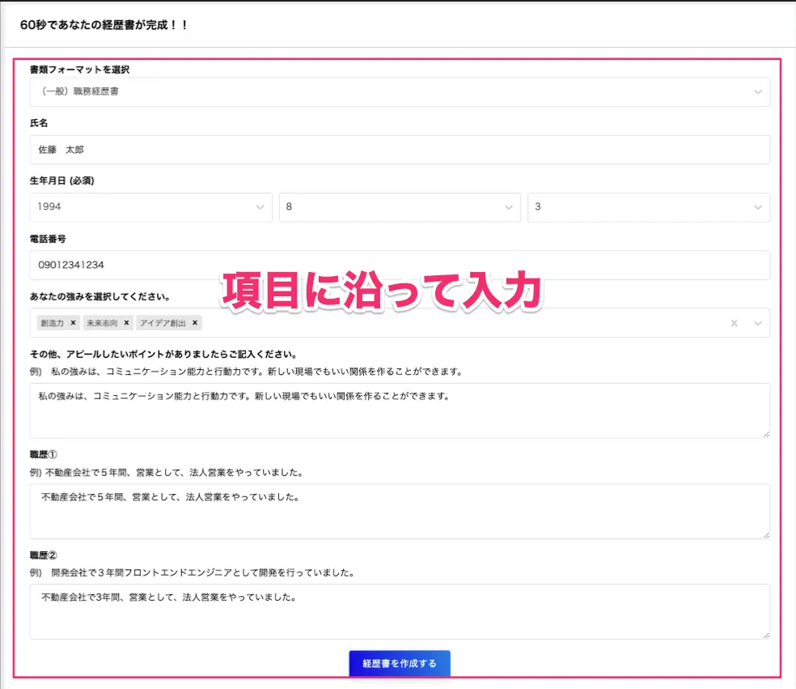
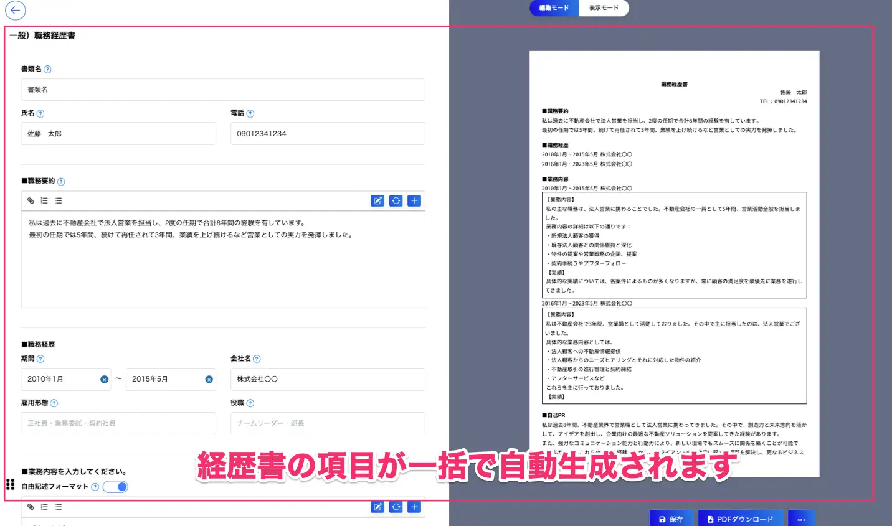

#60 秒で履歴書・職務経歴書が作成できる瞬間作成ツールの提供開始
生成 AI による履歴書・職務経歴書作成サービス RESUMY.AI は、60 秒で履歴書・職務経歴書が作成できるツールをリリースしました。[生成 AI による履歴書・職務経歴書作成サービス RESUMY AI](https://www.resumy.ai)

[履歴書・職務経歴書の瞬間作成ツール](https://www.resumy.ai/instant_creation)

##RESUMY.AI の新機能「瞬間作成ツール」

この度、RESUMY.AI ユーザーの皆様から頂戴したご意見をもとに、新機能として履歴書、職務経歴書の「瞬間作成ツール」を追加致しました。瞬間作成ツールとは、可能な限り最短で履歴書や職務経歴書などの応募書類が作成できるよう、いくつかの基本的な項目を入力するだけで、AI があなたの経歴書を一括で生成できる機能です。サービス試験導入の結果、80％以上の方が 60 秒程度で履歴書・職務経歴書を完成させることができております。

[職務経歴書の作成方法](https://www.youtube.com/shorts/AcWqRY77u3g)

##瞬間作成ツールの使い方

1、必要な項目を入力

2、「作成する」ボタンをクリック

3、60 秒であなたの経歴に沿った応募書類の概要が完成！

（社名等の情報は AI 生成後に入力する必要があります）

#サービスの無料提供

瞬間作成ツールは、より多くの皆様に使っていただけるよう完全無料で機能を提供しております。既存の各職種ごとのテンプレートの作成機能も並行して利用が可能な仕様になっております。
